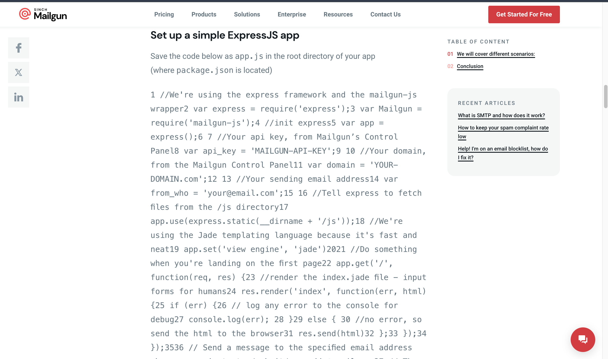

# What Mailgun does not think : A Developer's Perspective

## Introduction
In the digital age, communication is the key, and email remains a cornerstone of modern communication. Mailgun, a popular email service provider, offers developers a powerful toolset for managing transactional emails efficiently. However, delving into Mailgun's documentation reveals gaps and inconsistencies that hinder developers' understanding and adoption. In this article, we explore what Mailgun might not be fully aware of from a developer's viewpoint and suggest improvements to enhance the integration experience.

## Clarity in Documentation
One of the fundamental aspects of any developer tool's documentation is clarity. Yet, Mailgun's current documentation, as seen in its Node.js integration guide, lacks readability and coherence. Code snippets are presented in a raw format, making it challenging for developers to grasp the context and implementation nuances. For instance, the use of variable placeholders like 'YOUR-DOMAIN.com' and 'MAILGUN-API-KEY' without clear instructions on customization adds ambiguity.

## Enhanced Presentation
To address these issues, Mailgun could benefit from a more aesthetically pleasing and developer-friendly presentation of its documentation. Mailgun could incorporate syntax highlighting, indentation, and inline comments to enhance code readability. By adopting a standardized format for code snippets, developers can easily follow along and customize configurations to suit their needs.

[Mailgun Node.js Integration Guide](https://www.mailgun.com/blog/email/how-to-send-transactional-email-in-a-nodejs-app-using-the-mailgun-api/)



```javascript
// Import required modules
const express = require('express');
const Mailgun = require('mailgun-js');
const path = require("path");

// Initialize Express application
const app = express();

// Mailgun configuration
const api_key = 'MAILGUN-API-KEY';
const domain = 'YOUR-DOMAIN.com';
const from_who = 'your@email.com';

// Middleware to serve static files from the /js directory
app.use(express.static(path.join(__dirname, 'js')));

// Set Jade as the templating engine
app.set('view engine', 'jade');

// Define route for landing page
app.get('/', (req, res) => {
    res.render('index', (err, html) => {
        if (err) {
            console.error(err); // Log any error to the console for debugging
        } else {
            res.send(html); // Send the HTML to the browser
        }
    });
});

// Define route for submitting email
app.get('/submit/:mail', (req, res) => {
    const mailgun = new Mailgun({ apiKey: api_key, domain: domain });
    const data = {
        from: from_who,
        to: req.params.mail,
        subject: 'Hello from Mailgun',
        html: `Hello, This is not a plain-text email, I wanted to test some spicy Mailgun sauce in NodeJS! <a href="http://0.0.0.0:3030/validate?${req.params.mail}">Click here to add your email address to a mailing list</a>`
    };

    mailgun.messages().send(data, (err, body) => {
        if (err) {
            res.render('error', { error: err });
            console.error("got an error: ", err);
        } else {
            res.render('submitted', { email: req.params.mail });
            console.log(body);
        }
    });
});

// Define route for validating email
app.get('/validate/:mail', (req, res) => {
    const mailgun = new Mailgun({ apiKey: api_key, domain: domain });
    const members = [{ address: req.params.mail }];

    mailgun.lists('NAME@MAILINGLIST.COM').members().add({ members: members, subscribed: true }, (err, body) => {
        console.log(body);
        if (err) {
            res.send("Error - check console");
        } else {
            res.send("Added to mailing list");
        }
    });
});

// Define route for sending invoice
app.get('/invoice/:mail', (req, res) => {
    const fp = path.join(__dirname, 'invoice.txt');
    const mailgun = new Mailgun({ apiKey: api_key, domain: domain });
    const data = {
        from: from_who,
        to: req.params.mail,
        subject: 'An invoice from your friendly hackers',
        text: 'A fake invoice should be attached, it is just an empty text file after all',
        attachment: fp
    };

    mailgun.messages().send(data, (error, body) => {
        if (error) {
            res.render('error', { error: error });
        } else {
            res.send("Attachment is on its way");
            console.log("attachment sent", fp);
        }
    });
});

// Start Express server
app.listen(3030, () => {
    console.log('Server running on port 3030');
});

```
## Clarifying Package Dependencies
Another area for improvement lies in clarifying package dependencies. In the Node.js ecosystem, developers have two distinct Mailgun packages available: mailgun.js and mailgun-js. However, Mailgun's documentation fails to elucidate the differences between these packages or provide guidance on choosing the appropriate one for a given use case. This ambiguity can lead to confusion and inefficiencies during integration.

## Comprehensive Guidance
To address this issue, Mailgun should augment its documentation with comprehensive guidance on package selection and usage scenarios. By clearly outlining the features, advantages, and limitations of each package, developers can make informed decisions based on their project requirements. Additionally, providing sample code snippets for both packages in relevant sections would facilitate seamless integration and minimize guesswork.

## Conclusion
In conclusion, while Mailgun offers a robust email delivery platform, there are areas where it can enhance its developer experience. By prioritizing clarity, consistency, and comprehensiveness in its documentation, Mailgun can empower developers to seamlessly integrate and leverage its services. Embracing developer feedback and leveraging tools like Hashnode to refine its documentation would not only elevate Mailgun's offering but also strengthen its position as a preferred choice for transactional email management.

